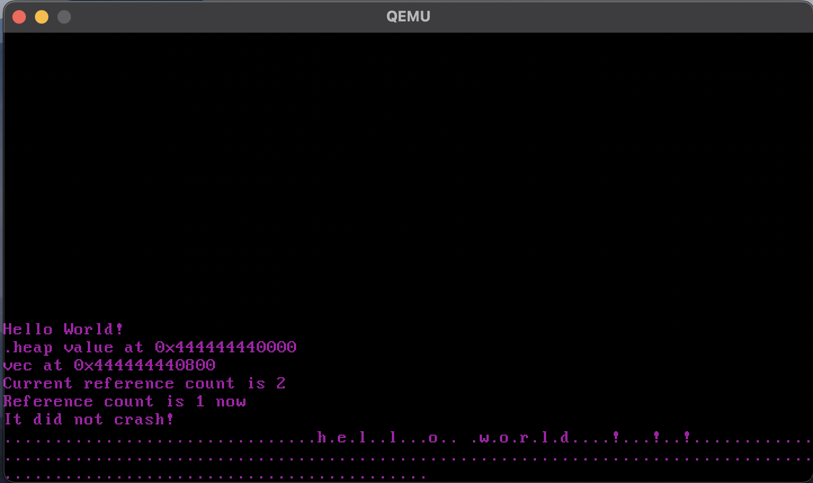

# rust_os 

My implementation of a bare metal operating system in Rust. I created this following Phil Opperman's blog at https://os.phil-opp.com/. 

## Running the application

You need to have Rust installed to run the application. Once you do, you can simply type `cargo run` in your terminal 

## Testing 

To run all of the unit tests run `cargo test` from any directory. All unit tests are packaged with the modules they are testing, and integration tests can be found in the `tests` directory. You can run specific integration tests by running `cargo test --test [test_name]`. 

## Dependencies 
This project has many external dependencies on libraries that assist with OS development. All of these dependencies are managed by `cargo`, the build system shipped with Rust. Some of these external packages include: 
* Bootloader: https://github.com/rust-osdev/bootloader
* x86_64: https://github.com/rust-osdev/x86_64
* uart_16550: https://crates.io/crates/uart_16550
* pic_8259: https://crates.io/crates/pic8259

Moreover, the code base uses Nightly Rust with some experimental features that are not yet included in the main language.

## Functionality 

The application includes many different functionalities including: 
* VGA Text Display 
* CPU Exceptions
* Hardware Interrupts
* Paging 
* Heap Allocation
* Async/Await 

Here's a sample of the OS running: 

